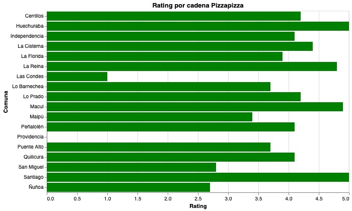

## README 

## Proceso de selección de datos y visualización; Paso a paso

## **Paso 1**:
En primer lugar, con mis compañeras de grupo
nos organizamos respecto a qué datos revisaría
cada una para poder desarrollar las historias que ya teníamos pensadas.
Es así, como gracias a la base de datos que obtuvimos de la empresa _Gregario_ me encargué de analizar las cadenas de pizzerías que se encuentran en el total de comunas de la región Metropolitana.

## **Paso 2**:
Desarrollé a mano una limpieza de la base de datos, en donde, consideré las variables: **comunas** para tener una gran variedad de elementos, **cadena** de pizzería para así indagar cómo cambiaba la evaluación por cadena, **cantidad de locales** para averiguar qué comunas son las que presentan una mayor cantidad. En este caso, Santiago, Maipú y Puente Alto lideran los datos. Finalmente consideré los **Reviews** que los entendemos como las opiniones o comentarios que las personas pueden tener respecto a una cadena de pizzería particular. Me sorprendió ver cómo algunos reviews eran más de 20.000, mientras que en otros lugares no alcanza una decena. La última variable a considerar fue **Rating** que la podemos entender como la "nota" o "puntuación" que las personas dentro de los reviews han realizado.

## **Paso 3**:
Un paso que realicé mientras revisaba las variables, fue escoger sólo aquellos locales que tenían mayor reviews, ya que de esta forma podríamos tener una mayor certeza de la valoración en el Rating de las pizzerías. Es por esto, que por cada comuna hay solo un local de cada cadena de pizzería.

## **Paso 4**: 
Al tener considerado los elementos que emplearía, cree un archivo excel para seleccionar los datos. Seguí el orden que está establecido en la web de _Gregario_ donde están ordenadas las comunas de mayor a menor, respecto al número de locales. 

## **Paso 5**:
Mi historia surge en base a la interrogante de por qué algunas cadenas de pizzerías están mejor evaluadas que otras y por qué esta diferencia está más marcada en aquellas comunas con mayor población y nivel socioeconómico. Para ello, consideré que la visualización solamente tuviera las columnas de **comuna**, **cadena** y **rating**

## **Paso 6**: 
Al revisar los datos, me di cuenta que la cadena Pizzapizza era la que mayor variación tenía en sus Rating, en comparación a otras cadenas de pizzerías. Por ejemplo, Melt Pizza y Papa Jhon´s en la mayor cantidad de comunas están muy bien evaluadas. Esto se relaciona con otras informaciones, por ejemplo, que Papa Jhon´s es la pizzería que más ha crecido a lo largo de Chile en el último tiempo, Melt Pizza también ha experimentado un crecimiento.Sin embargo, Pizzapizza es una cadena relativamente vieja, que lleva tiempo en el país, pero algo ha ocurrido que no le permite alcanzar los números de sus competencias.

## **Paso 7**:
Teniendo esto en consideración, a través de Google Colab desarrollé un Python que me permitiera crear un gráfico de barras horizontales, de tal manera que evidenciara los Rating por comuna de acuerdo con la cadena Pizzapizza. Me basé en las ayudantías de Altair para la mayor cantidad de códigos. Sin embargo, al tener dificultades en encontrar el gráfico que quería, utilicé herramientas de _CHATGPT_ para la visualización.

Cabe destacar, que dentro de los datos empleados tuve que modificar las comas del Rating por puntos, para que se leyera de forma correcta. Asimismo, Providencia es la única comuna, que tiene un local Pizzapizza sin rating, sin embargo cuenta con Reviews, por lo tanto tomé la decisión de dejarlo con valoración 0.0 que representa "sin datos" o "sin información", dado que la escala va de 1.0 a 5.0 siendo 1.0 la peor nota y 5.0 el máximo.

## **Paso 8**: 
Tuve dificultades para descargar el archivo como HTML, pero la Profesora Kat me orientó y ayudó a que el archivo quedara como su versión final y la cual está subida en el repositorio. 

# Preguntas que se pueden responder a partir de la base de datos

Son diferentes las conclusiones a las que se puede llegar con esta base de datos. En primer lugar que sólo dos comunas tienen una alta puntuación y una la nota más baja. 

Algunas preguntas que podemos responder con esta base de datos son:

*¿Cuáles son las comunas que evalúan mejor a esta pizzería?*

Santiago, una comuna con una gran población y que tiene, a su vez, un gran flujo de personas diario la evalúa de mejor manera con Rating de 5.0, misma puntuación ocurre con Huechuraba, comuna ubicada al norte del país 

*¿Por qué ocurre este fenómeno?* 

Una posible conclusión a la que podemos llegar, es que estas comunas pese a tener otras cadenas de pizzerías en su sector, puede privilegiar los precios, ofertas y el tiempo de espera. Pizzapizza se destaca porque históricamente ha tenido promos 2x1 casi toda la semana, sus pizzas son más artesanales, con masas gruesas e ingredientes variados que satisfacen. Si pensamos en estas comunas, especialmente Santiago, que como antes mencionaba, tiene un gran flujo de personas diario podemos analizar que prefieran ir a estos centros o que su experiencia sea mejor. 

*¿Cuáles son las comunas que evalúan de peor manera la cadena?*

Consideremos que una mala evaluación es desde los 3.5 puntos hacia abajo. Teniendo en cuenta que el promedio para Pizzapizza es de 3.9 aproximadamente. Las Condes, Ñuñoa, San Miguel y Maipú son las comunas que tienen notas bajo los 3.5, siendo Las Condes la más baja con un Rating de 1.0. 

*¿Qué puede ocurrir aquí?*

Pasa con estas comunas, especialmente Las Condes, Ñuñoa y San Miguel que cuentan con una gran variedad de pizzerías y variados locales de comida en sus territorios. Por lo tanto, esta cadena que no es la número uno en popularidad o dentro de las que más consumen las personas, está muy por debajo de la competencia.

Los análisis que podemos desarrollar en base a estas comunas es que Pizzapizza no brinda las necesidades que las personas que prefieren este tipo de alimentos, buscan satisfacer. 

Observación: Esta gráfica podría analizarse de mejor manera si estuviera ordenada de mayor a menor, ya que así se evidenciaría más las diferencias y cómo baja cada vez más de nota, no las mantiene por comuna. Sin embargo, no logré aplicar los códigos necesarios. Cuando lo intentaba me arrojaba error. 

*¿Providencia no cuenta con esta cadena?*

Al contrario, Providencia tiene un local de Pizzapizza con 440 reviews, sin embargo, no tiene Rating o puntuación, por lo tanto al colocarle un Rating 0.0 referido a que no existe el dato, se visualiza de esa forma en el gráfico.

*¿Qué locales convienen visitar tras revisar el gráfico?*

Sin dudas, los locales de esta cadena en particular a los que, de acuerdo con el Rating, conviene asistir serían aquellos que tengan una puntuación de 4.5 en adelante: Huechuraba, La Reina, Macul y Santiago.

*¿Qué locales deberíamos evitar o necesitan cambios?*

Podemos analizar que los locales que no deberíamos visitar, en el caso de un amante de la pizza que busque recorrer esta cadena, evitaría asistir al local de la comuna: Las Condes, San Miguel y Maipú. 

